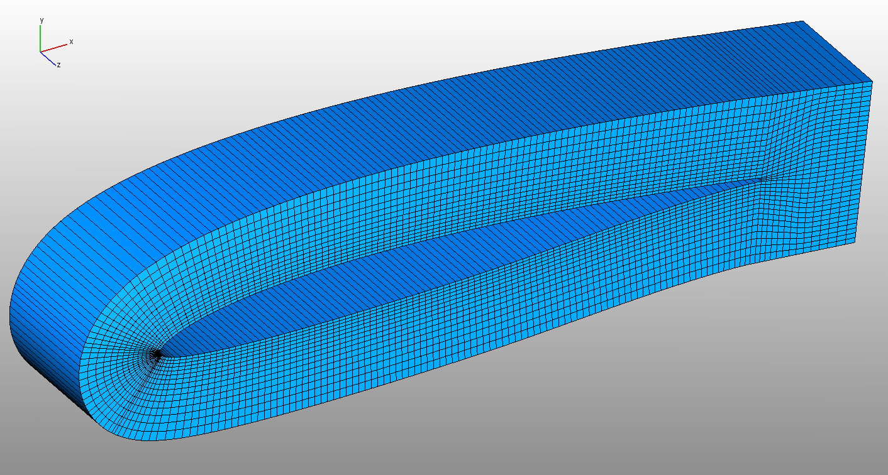

```diff
+ RELEASE 1.0 IS READY.
+ MESHES CAN BE GENERATED
- SU2 and GMESH formats not tested
- 4 individual mesh blocks around the airfoil are created and need to be connected (will be fixed soon)
```

# PyAero
> PyAero is an open-source airfoil contour analysis and CFD meshing tool written in Python.


<p align="center">PyAero GUI at a glance</p>


<p align="center">Example mesh as used in the AVL-FIRE CFD code. Third mesh dimension in 2D is 1 cell layer.</p>

## Features

 - Airfoil splining and refining
 - Airfoil contour analysis (implemented, but disabled at the moment)
 - Trailing edge generation, i.e. blunt trailing edge instead of sharp trailing edge
 - Automatic generation of block-strcuctured meshes for airfoils
 - Mesh control
 - Mesh smoothing (to be improved)
 - NOT YET IMPLEMENTED: Automatic definition of boundary faces
 - Mesh export
   - [AVL FIRE](http://www.avl.com/fire-m) (.flma)
   - [SU2](http://su2.stanford.edu) (.su2)
   - [GMESH](http://gmsh.info) (.msh)
 - Simple aerodynamic analysis using [AeroPython](http://nbviewer.ipython.org/github/barbagroup/AeroPython/blob/master/lessons/11_Lesson11_vortexSourcePanelMethod.ipynb)
 - NOT YET IMPLEMENTED: Advanced aerodynamic analysis
   - Linking to open source CFD software (e.g. SU2)

## Dependencies

Releases in brackets refer to my current (January 8th 2017) installation

 - Python (2.7.12)
   - not tested with any version less than 2.7
 - PyQt4 (4.11.4)
 - numpy (1.11.2)
 - scipy (0.15.1)
 - matplotlib (1.5.3)
   - not needed for meshing
   - for contour analysis
   - already implemented, but currently set to disabled
 - PyVTK (6.1.0)
   - not needed for meshing
   - just implemented for playing around

## Documentation

The [PyAero documentation](http://pyaero.readthedocs.io/en/latest) is hosted at [Read the Docs](https://readthedocs.org/).

An introductory [PyAero tutorial video](https://www.youtube.com/watch?v=RBrBEyHAAss) can be found on YouTube.

The documentation is automatically generated using the files in the [docs](https://github.com/chiefenne/PyAero/tree/master/docs) folder via [Sphinx](http://www.sphinx-doc.org/en/stable/index.html).

## Installation

Currently there are no binaries available. Therefore, the source code needs to be copied to your computer.

The instructions below have been tested on Windows (using a console terminal from Cygwin) and on Linux.

### Using Git:

```bash
cd anywhere_on_your_computer
$ git clone https://github.com/chiefenne/PyAero.git
```

### Alternatively download a ZIP file:

From the [PyAero GitHub repository](https://github.com/chiefenne/PyAero). There is on the upper right side a green pull down menu "Clone or download". Click on it and then click "Download ZIP". You get a file "PyAero-master.zip" which you store anywhere on your computer.

```bash
cd anywhere_on_your_computer
unzip PyAero-master.zip
```

After cloning from Git (or downloading and unzipping from Git) set the environment variable for the PyAero installation path:

```bash
setenv PYAERO_PATH path_to_your_installation
```

Then set an **alias** to any start command that you like.

```bash
alias pyaero  $PYAERO_PATH/src/PyAero.py
```

Then start PyAero using simply:

```bash
pyaero
```
You might want to add PYAERO_PATH to your .login script (or equivalent Windows setup). Likewise the start command can be added to .cshrc or any *.bat file on Windows.

You should be good to go.

## Release History

* 1.0
    * Meshes can be generated now.
    * Export available in AVL-FIRE, SU2 and GMESH formats

* 0.9
    * GUI is almost ready, at least ready to be able to do meaningful work
    * All preparations for mehing are done
    * Airfoil contours can be loaded, splined and refined
    * A trailing edge thickness can be added

* 0.8
    * Raw functionality of GUI available
    * Zooming and moving works
    * Airfoils can be loaded (also multiple airfoils is possible)


Andreas Ennemoser – [@chiefenne](https://twitter.com/chiefenne) – andreas.ennemoser@aon.at
 
Distributed under the MIT license. See LICENSE for more information.
