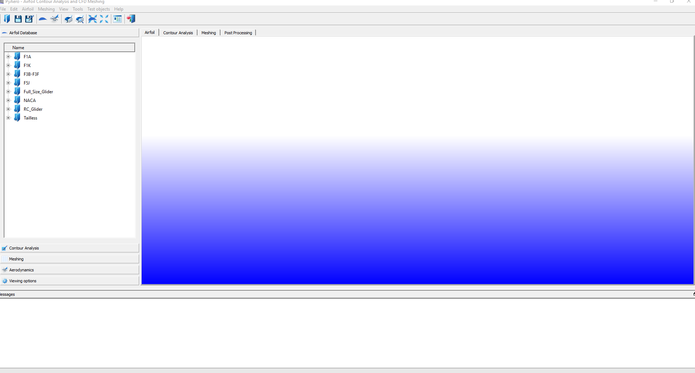

# PyAero
> PyAero is an open-source airfoil contour analysis and CFD meshing tool written in Python.

## Features

 - Airfoil contour analysis, refining and splining
 - Trailing edge generation
 - Automatic generation of block-strcuctured meshes for airfoils
 - Mesh control and smoothing
 - Automatic definition of boundary faces
 - Mesh export (AVL FIRE .flm, SU2 .su2)
 - Simple aerodynamic analysis, i.e. panel methods
 - Advanced aerodynamic analysis, i.e. linking to open source CFD software

## Dependencies

 - PyQt4
 - PyVTK
 - numpy, scipy, matplotlib
 - lxml (will be removed)

## Documentation

The documentation is hosted at [Read the Docs](http://pyaero.readthedocs.io/en/latest).

It is automatically generated using the files in the [docs](https://github.com/chiefenne/PyAero/tree/master/docs) folder via [Sphinx](http://www.sphinx-doc.org/en/stable/index.html).

## Release History

* 0.5
    * Work in progress

Andreas Ennemoser – [@chiefenne](https://twitter.com/chiefenne) – andreas.ennemoser@aon.at
 
Distributed under the MIT license. See LICENSE for more information.
