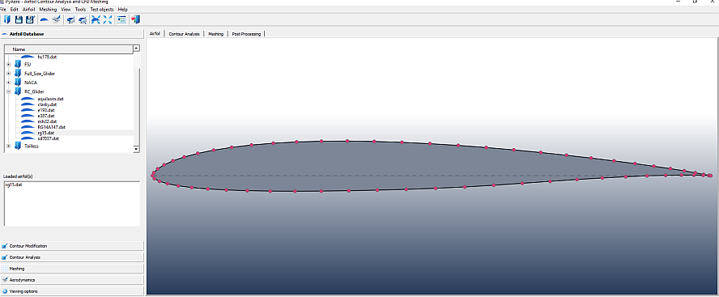
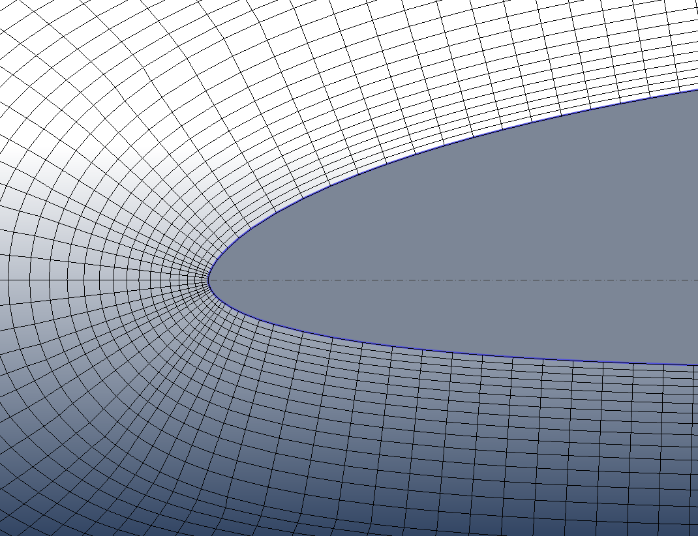
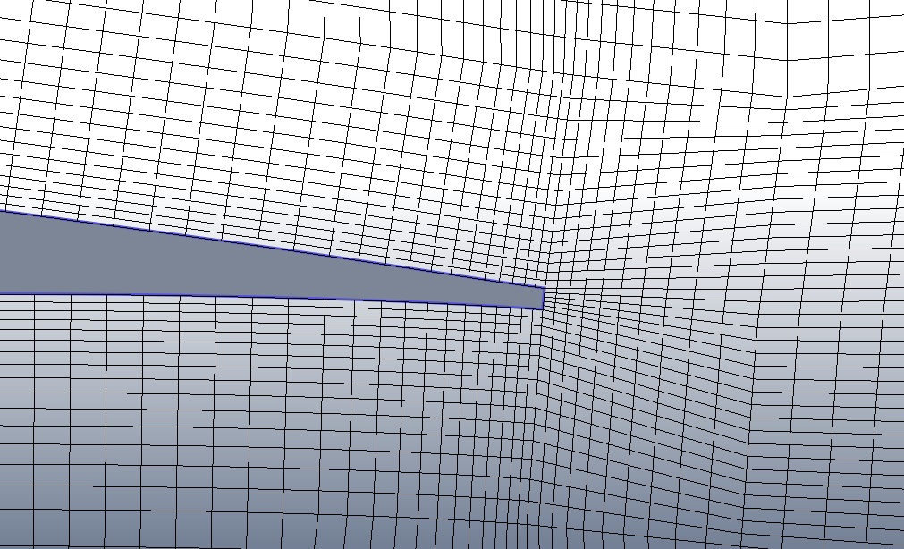

```diff
+ RELEASE 1.1 IS READY.
+ MESHES CAN BE GENERATED AND EXPORTED
```

```diff
- SU2 format not yet tested
- contour analysis to be refactored and enabled again
```

# PyAero
> PyAero is an open-source airfoil contour analysis and CFD meshing tool written in Python.


<p align="center">PyAero GUI at a glance</p>


<p align="center">Example mesh around HN1033 airfoil</p>


<p align="center">Example mesh around HN1033 airfoil - Leading Edge</p>


<p align="center">Example mesh around HN1033 airfoil - Trailing Edge (with finite thickness)</p>


<p align="center">Example mesh as used in the AVL-FIRE CFD code. Third mesh dimension in 2D is 1 cell layer.</p>

## Features

 - Airfoil splining and refining
 - Airfoil contour analysis (implemented, but disabled at the moment)
 - Trailing edge generation, i.e. blunt trailing edge instead of sharp trailing edge
 - Automatic generation of block-strcuctured meshes for airfoils
 - Mesh control
 - Mesh smoothing (to be improved)
 - NOT YET IMPLEMENTED: Automatic definition of boundary faces
 - Mesh export
   - [AVL FIRE](http://www.avl.com/fire-m) (.flma)
   - [SU2](http://su2.stanford.edu) (.su2)
   - [GMSH](http://gmsh.info) (.msh)
 - Simple aerodynamic analysis using [AeroPython](http://nbviewer.ipython.org/github/barbagroup/AeroPython/blob/master/lessons/11_Lesson11_vortexSourcePanelMethod.ipynb)
 - NOT YET IMPLEMENTED: Advanced aerodynamic analysis
   - Linking to open source CFD software (e.g. SU2)

## Dependencies

Releases in brackets refer to my current (January 8th 2017) installation

 - Python (2.7.12)
   - not tested with any version less than 2.7
 - PyQt4 (4.11.4)
 - numpy (1.11.2)
 - scipy (0.15.1)
 - matplotlib (1.5.3)
   - not needed for meshing
   - for contour analysis
   - already implemented, but currently set to disabled
 - PyVTK (6.1.0)
   - not needed for meshing
   - just implemented for playing around

## Documentation

The [PyAero documentation](http://pyaero.readthedocs.io/en/latest) is hosted at [Read the Docs](https://readthedocs.org/).

An introductory [PyAero tutorial video](https://www.youtube.com/watch?v=RBrBEyHAAss) can be found on YouTube.

The documentation is automatically generated using the files in the [docs](https://github.com/chiefenne/PyAero/tree/master/docs) folder via [Sphinx](http://www.sphinx-doc.org/en/stable/index.html).

## Download

Currently there are no binaries available. Therefore, the source code needs to be copied to your computer.

### Option 1: Download using Git:
The $ symbol represents the prompt at command shell. It is not part of the command.

```bash
$ cd anywhere_on_your_computer
$ git clone https://github.com/chiefenne/PyAero.git
```

or for a specific version, e.g. for version 1.0.0:

```bash
git clone --branch v1.0.0 https://github.com/chiefenne/PyAero
```

### Option 2: Download a ZIP file:

From the [PyAero GitHub repository](https://github.com/chiefenne/PyAero). There is on the upper right side a green pull down menu "Clone or download". Click on it and then click "Download ZIP". You get a file "PyAero-master.zip" which you store anywhere on your computer.

```bash
$ cd anywhere_on_your_computer
$ unzip PyAero-master.zip
```

Or for a specific version, e.g. for version 1.0.0 [goto the release page](https://github.com/chiefenne/PyAero/releases) and download the file **Source code.zip** or click [here](https://github.com/chiefenne/PyAero/archive/v1.0.0.zip) for direct download of version v1.0.0.

## Installation

After cloning from Git, or downloading and unzipping, set the environment variable for the PyAero installation path.

### Linux and Cygwin

```bash
$ setenv PYAERO_PATH path_to_your_installation
```

Run PyAero using:

```bash
$ python $PYAERO_PATH/src/PyAero.py
```

To simplify the command, set an *alias*.

```bash
$ alias pyaero  "python $PYAERO_PATH/src/PyAero.py"
```

Then start PyAero using simply:

```bash
$ pyaero
```

To keep everything stored across session, you might want to add PYAERO_PATH to your *.login* script. Likewise the start command can be added to *.cshrc*.

### Windows

In a cmd shell type (if the installation is on drive *D:* in the folder *My_PyAero_Installation_Path*):

```bash
$ set PYAERO_PATH=D:/My_PyAero_Installation_Path
```

Since this stores the PYAERO_PATH variable only for the current seesion, you can aslo press the Win+Pause keys and then open the advanced tab to set the PYAERO_PATH environment variable there to keep it also after reboot.

Run PyAero using from a cmd shell (if python is installed in "c:/python27"):

```bash
$ c:/python27/python.exe %PYAERO_PATH%/src/PyAero.py
```

You should be good to go.

## Release History

* 1.1.0
    * FIRE and GMSH mesh can be generated and exported correctly.
    * A single mesh is exported now; no need anymore to connect them later manually
    * Right mouse button (if dragged, i.e. press and move) moves geometry or mesh

* 1.0.0
    * Meshes can be generated now.
    * Export available in AVL-FIRE, SU2 and GMSH formats

Andreas Ennemoser – [@chiefenne](https://twitter.com/chiefenne) – andreas.ennemoser@aon.at
 
Distributed under the MIT license. See LICENSE for more information.
